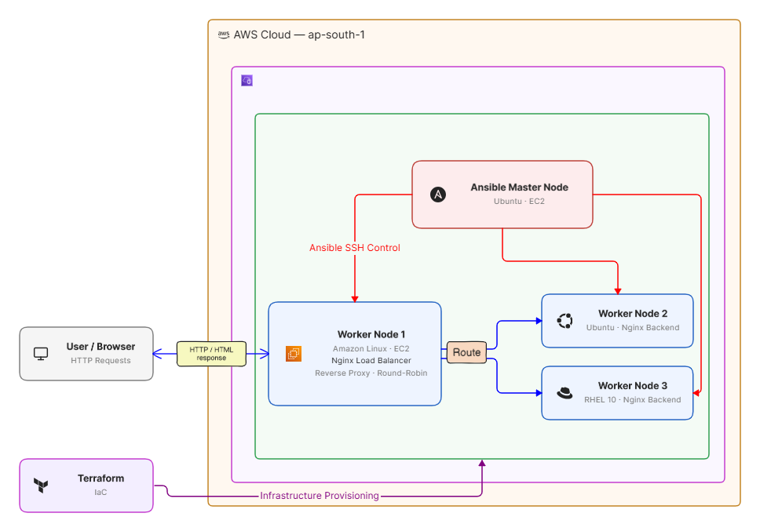

# Ansible Load Balancer Cluster on AWS

A project that provisions a multi-node AWS infrastructure using Terraform and configures a Round-Robin Nginx Load Balancer across the cluster using Ansible ad-hoc commands.

The setup consists of 4 EC2 instances spanning different operating systems (Amazon Linux, Ubuntu, and RHEL), where one node acts as the Ansible control node, another serves as the Nginx Load Balancer, and the remaining two function as backend web servers.

---

## Architecture



When a user hits the public IP of Worker 1, Nginx forwards the request to one of the backend servers using the Round-Robin algorithm. Each refresh routes the traffic to the next server in the pool.


## Tech Stack

| Tool        | Purpose                                          |
|-------------|--------------------------------------------------|
| Terraform   | Provision EC2 instances, Security Groups, VPC    |
| Ansible     | Configure servers, install packages, deploy files |
| Nginx       | Load Balancer (reverse proxy) and web server      |
| AWS         | Cloud provider (ap-south-1 region)                |

---

## Infrastructure Details

### EC2 Instances

| Node                  | AMI                     | OS            | Role            |
|-----------------------|-------------------------|---------------|-----------------|
| ansible-master-node   | ami-01a00762f46d584a1   | Ubuntu        | Ansible Control |
| ansible-worker-node-1 | ami-0ac7b260cf76d8865   | Amazon Linux  | Load Balancer   |
| ansible-worker-node-2 | ami-01a00762f46d584a1   | Ubuntu        | Backend Server  |
| ansible-worker-node-3 | ami-0011550b539717e2a   | RHEL 10       | Backend Server  |

- Instance Type: `t3.micro`
- Root Volume: `10 GB gp3`
- Security Group: Allows inbound SSH (22) and HTTP (80), all outbound traffic open

### Terraform Highlights

- Used `for_each` with a `map(string)` variable to dynamically provision all 4 instances from a single resource block instead of duplicating code
- Each instance gets a different AMI ID mapped through the `node_amis` variable
- Outputs use a `for` expression to display Instance ID and Public IP grouped by node name

---

## Ansible Configuration

### Inventory Structure (`/etc/ansible/hosts`)

```ini
[loadbalancer]
worker1 ansible_host=<WORKER_1_IP> ansible_user=ec2-user

[backends]
worker2 ansible_host=<WORKER_2_IP> ansible_user=ubuntu
worker3 ansible_host=<WORKER_3_IP> ansible_user=ec2-user

[workers_servers:children]
loadbalancer
backends

[workers_servers:vars]
ansible_python_interpreter=/usr/bin/python3
ansible_ssh_private_key_file=/home/ubuntu/keys/terra-ec2-instance-key
```

Key points:
- Workers are split into `loadbalancer` and `backends` groups for role-based targeting
- `workers_servers` is a parent group using `:children` to combine both groups
- Common variables like `ansible_ssh_private_key_file` and `ansible_python_interpreter` are set once under `:vars` instead of repeating per host
- `host_key_checking` is set to `False` in `/etc/ansible/ansible.cfg` to handle first-time SSH connections without interactive prompts

---

## Setup Steps

### 1. Generate SSH Key Pair

```bash
ssh-keygen -t ed25519 -f terra-ec2-instance-key -N ""
```

### 2. Provision Infrastructure with Terraform

```bash
terraform init
terraform plan
terraform apply -auto-approve
```

This creates 4 EC2 instances, a Security Group (SSH + HTTP), and uploads the public key to AWS.

### 3. Set Up the Ansible Control Node

SSH into the master node and install Ansible:

```bash
sudo apt update && sudo apt install ansible -y
```

Copy the private key to the master node and set up the inventory file at `/etc/ansible/hosts` with the worker IPs from the Terraform output.

### 4. Verify Connectivity

```bash
ansible workers_servers -m ping
```

Expected output: `SUCCESS` with `"ping": "pong"` from all 3 workers.

### 5. Install Nginx on the Load Balancer (Worker 1)

```bash
ansible worker1 -a "sudo yum install nginx -y"
ansible worker1 -a "sudo systemctl start nginx"
```

### 6. Configure the Load Balancer

Create a `nginx.conf` on the master node with the upstream block pointing to Worker 2 and Worker 3 IPs, then push it using the `copy` module:

```bash
ansible worker1 -b -m copy -a "src=nginx.conf dest=/etc/nginx/nginx.conf backup=yes"
ansible worker1 -a "sudo systemctl restart nginx"
```

The Nginx config uses `upstream` with Round-Robin (default) to distribute traffic:

```nginx
events {}
http {
    upstream backend_servers {
        server <WORKER_2_IP>;
        server <WORKER_3_IP>;
    }
    server {
        listen 80;
        location / {
            proxy_pass http://backend_servers;
        }
    }
}
```

### 7. Set Up Backend Servers

Install Nginx and deploy the HTML pages to Worker 2 and Worker 3:

```bash
ansible worker2 -a "sudo apt install nginx -y"
ansible worker2 -b -m copy -a "src=worker2.html dest=/var/www/html/index.html"

ansible worker3 -a "sudo yum install nginx -y"
ansible worker3 -a "sudo systemctl start nginx"
ansible worker3 -b -m copy -a "src=worker3.html dest=/usr/share/nginx/html/index.html"
```

Note: Ubuntu serves from `/var/www/html/` while Amazon Linux and RHEL serve from `/usr/share/nginx/html/` — this is handled by targeting each worker separately.

### 8. Test the Load Balancer

Open the public IP of Worker 1 in a browser. Refresh the page multiple times — the response alternates between Worker 2 and Worker 3, confirming the Round-Robin routing is working.

---

## Useful Ansible Ad-Hoc Commands Used

```bash
# Ping all workers
ansible workers_servers -m ping

# Check memory on all workers
ansible workers_servers -a "free -h"

# Check disk space on all workers
ansible workers_servers -a "df -h"

# Update packages on Amazon Linux workers
ansible worker1 -a "sudo yum update -y"

# Update packages on Ubuntu workers
ansible worker2 -a "sudo apt-get update"

# Copy a file to a remote server with backup
ansible worker1 -b -m copy -a "src=nginx.conf dest=/etc/nginx/nginx.conf backup=yes"
```

---

## File Structure

```
.
├── ec2.tf                       # EC2 instances, Security Group, VPC, Key Pair
├── variables.tf                 # All configurable variables with defaults
├── outputs.tf                   # Mapped output of instance IDs and public IPs
├── providers.tf                 # AWS provider configuration
├── terraform.tf                 # Terraform version and provider requirements
├── .gitignore                   # Ignores state files, keys, and .terraform/
└── README.md
```

---

## Cleanup

To destroy all the provisioned infrastructure:

```bash
terraform destroy -auto-approve
```
